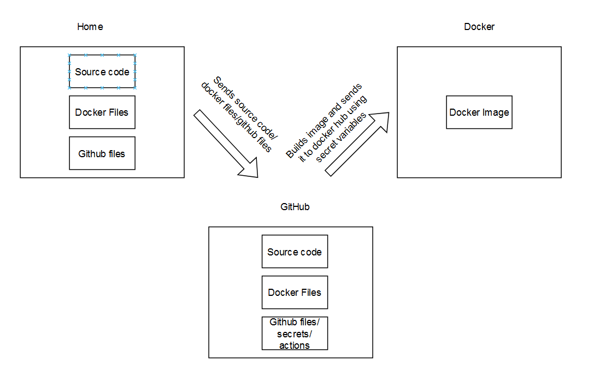

# PROJECT 4 README

## Part 1
### Overview
This part of the project defines the Dockerfile that will be used to create the image for the web server. This is done so that the service can be easily built and ran with minimal configuration and management. The tool used for this portion is Docker.

### Containerizing Applications
* Docker installation
    * Download docker desktop from https://www.docker.com/ using installer that matches current system
* Building container without image
    * `docker run` command with `node:18-bullseye` base image and the flags `-p 80:4200` and `-it` with bash at the end to enter a bash shell
    * `docker cp [src] container:[dest]` to move files into image or use a binding mount
* Summary of Dockerfile
    * `FROM` to pick the base image for the container
    * `WORKDIR` to set/create the current directory
    * `COPY` to copy the contents of the angular-site to the container
    * `RUN` to run install all of the node dependicies during build
    * `EXPOSE` to provide a port to access the web page
    * `CMD` to execute the command needed to start the webpage when the container is launched
* How to build an image
    *  `docker build -t <tag-name> <image-name> <directory>`
* How to run container from a built image
    * `docker run [flags] <image>`
* View the application by going to a browser and opening `localhost:80`

### Working with Dockerhub
* To create a repo, go to dockerhub website (while signed in), go to repositories tab, and create a repo
* To authenticate, I signed into the docker desktop app / Can also use `docker login` to connect CLI/app to account through web login
* Pushing a container image to DockerHub
    * Commit container image to repo
        * `docker container commit angular-app insanityveins/ivery-ceg3120:angular-app`
    * Push image to repo
        * `docker push insanityveins/ivery-ceg3120:angular-app`

## Part 2

### Configuring GitHub Secrets
* Create a github secret for a repo by going to the repo's settings > Secrets and Variables > New repository secret
* Docker username and token key is set for this project

### Behavior of GitHub workflow
* My workflow checks out the repository (I don't think this one is needed but it works so I am not breaking it 😇) and other all of the docker pieces necessary to build and push an image to docker hub. It utilized my docker account through means of a token for authentication.
* [Link to Workflow](https://github.com/WSU-kduncan/f24cicd-Insanityveins/tree/main/.github/workflows)
* To duplicate this project, another user would need to edit the Docker Username/Password secrets for the image build and push to work successfully.

## Part 3
### Diagram

